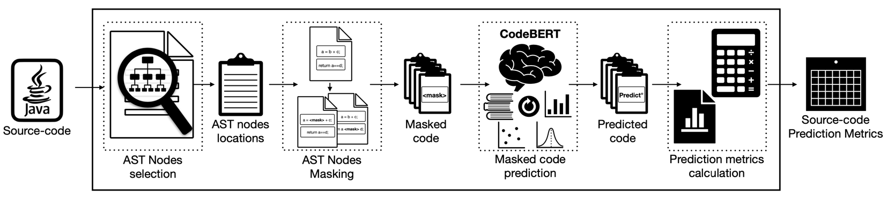

# CodeBERT-nt: code naturalness via CodeBERT

Computes and ranks code by naturalness captured by CodeBERT.

## Conference (QRS-2022): "CodeBERT-nt: code naturalness via CodeBERT" 
available at: https://doi.org/10.48550/arXiv.2208.06042

    @article{khanfir2022codebertnt,
      title={CodeBERT-nt: code naturalness via CodeBERT},
      author={Khanfir, Ahmed and Jimenez, Matthieu and Papadakis, Mike and Traon, Yves Le},
      journal={arXiv preprint arXiv:2208.06042},
      year={2022}
    }

We have implemented our approach and evaluation as modules and made it available in different repositories, for a more convenient re-usage. 
If you just want to compute and rank code using CodeBERT-nt, you can skip these details and pass to the next subsection.
Otherwise, here's a quick summary of how we implemented our approach:

### AST parsing and location selection:
_Repo_ **(java)**: https://github.com/Ahmedfir/java-business-locations.git

In this step we parse the input java classes and extract the main business-logic nodes to mutate.
You can either clone and build the code yourself or use our released standalone jar directly.
Under `codebertnt/business-locs/javabusinesslocs-1.1.0-SNAPSHOT-jar-with-dependencies.jar`,
we incorporate the jar and call it directly from the python side, 
to extract the tokens of interest.
 
### Masking and CodeBERT invocation: 
_Repo_ **(python)**: https://github.com/Ahmedfir/cbnt

This repo contains the core implementation of our approach.
It provides APIs to mask tokens, invoke CodeBERT https://github.com/microsoft/CodeBERT to predict alternative replacements for them and process them, 
i.e. putting them in place in the original program to compute their cosine-embeddings similarity with the original version.
We continued evolving the implementation of this component and CodeBERT-nt, to provide functionalities needed for other works, 
i.e. https://github.com/Ahmedfir/mBERT-nt.git.

### ngramlineloc (n-gram as evaluation baseline):

_Repo_ **(python)**: https://github.com/Ahmedfir/ngramlineloc.git

_Repo_ **(java)**: https://github.com/Ahmedfir/java-n-gram-line-level.git

We share our **n-gram** (line-level) implementation in these repositories.
We have also implemented our **Complexity** based ranking baseline in this repository.

**ngramlineloc** uses the APIs provided by: https://github.com/electricalwind/tuna.git.

## run CodeBERT-nt:

### pre-requirements:

- Python 3.7+: This code has only been tested with Python version 3.7 and above. You can try older versions if you want...
- Python environment: you can use conda or pip to create an environement using `requirements.txt`. If you decide to use pip, just call `env_setup.sh`.
- Java 8: This code has only been tested with Java 8 and above. You can try older versions if you want...
- Dependencies: You will have to clone some repos or call `setup.sh` and it will be done. 
It depends on `https://github.com/Ahmedfir/cbnt` and `https://github.com/Ahmedfir/commons` implementations.
So you will have to include them in your `$PYTHONPATH` i.e.:
  - if you want to use PyCharm: 
  go to `Preferences` > `Project:CodeBERT-nt` > `Project structure` > `+` > `path/to/cloned/cbnt`. 
  Then similarly for `commons`: > `+` > `path/to/cloned/commons`
 
  - if you just want to run the tool via shell: 
  you need to add the dependencies to your `$PYTHONPATH`: `export path/to/cloned/commons:path/to/cloned/cbnt:$PYTHONPATH`

### rank lines:

- We provide an example script of how to run CodeBERT-nt via `run_codebertnt.sh`.
For this particular script, please check the `get_args()` method in `codebertnt/codebertnt_runner.py` for more information on other optional parameters.
We provide arguments in this script to compute the naturalness and rank the lines from a class: `DummyClass.java` available under `test` folder.
You can adapt the script to your needs.
- We provide `RemotePredictBusinessLocations` in `codebertnt/remote_cbnt_request.py` which is more convenient way to use our approach on datasets:
it allows the calculation of naturalness of projects not available locally.
Meaning that before executing the approach it will clone and checkout the target project first, then delete the repo once done. 
We provide as example the used implementation for our paper evaluation in `smartsharkeval/cbnat/process_project_bugs.py`.

## Reproduce evaluation results of CodeBERT-nt:

### pre-requirements:
Same as for the ones needed by CodeBERT-nt of course. So make sure to fulfill the described requirements in the previous subsection.
Additionally, it depends on `https://github.com/Ahmedfir/a12stats.git` and on ngramline `https://github.com/Ahmedfir/ngramlineloc.git`.

#### SmartShark dataset:

We provide the selected bugs for our study in a zipped archive `input.zip`.
The code for the SmartShark setup, bugs preprocessing and selection is under `smartsharkeval/setup`. 
If you have any issue setting-up smartshark, please follow the instruction provided in the dataset website:
`https://smartshark.github.io/dbreleases/` .

### lines ranking:
We provide the scripts that we have used to rank the lines by naturalness using each of:
  
- CodeBERT-nt: in `smartsharkeval/cbnat/process_project_bugs.py` and
- n-gram: in `smartsharkeval/ngram/process_project_bugs.py`.

## Next todos:

- More testing.
- Better documentation.
